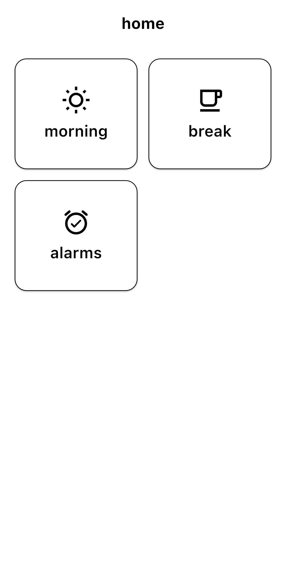
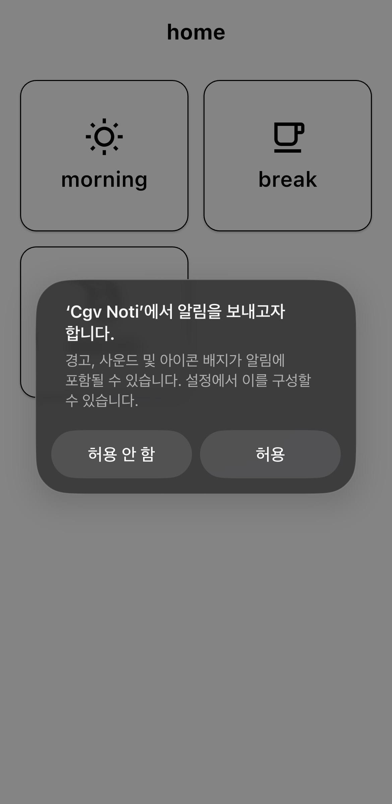
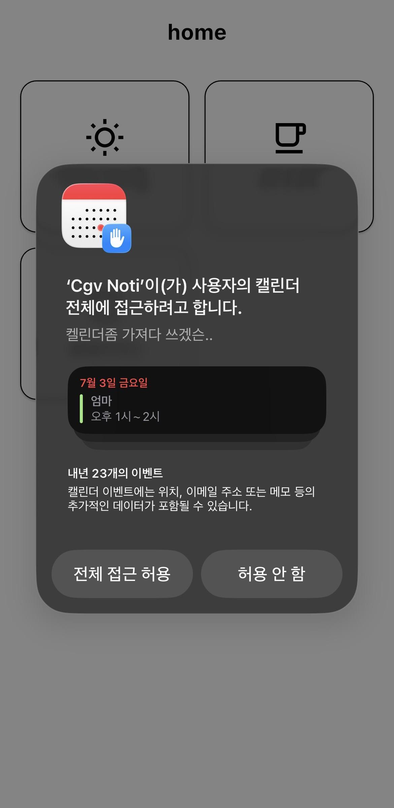
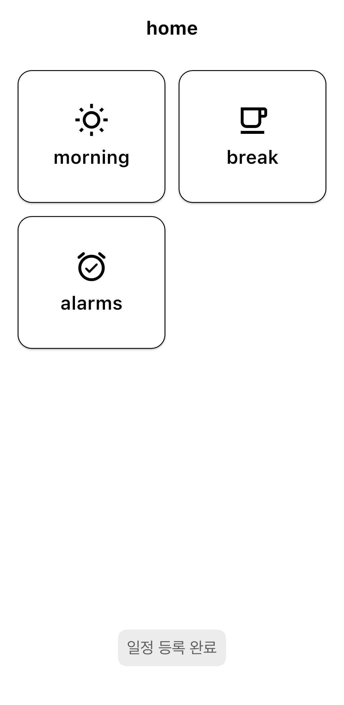
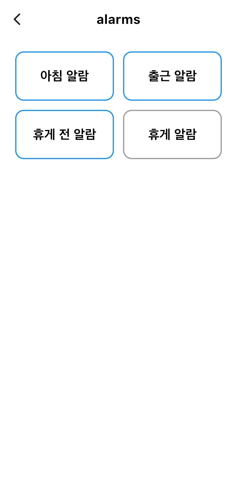
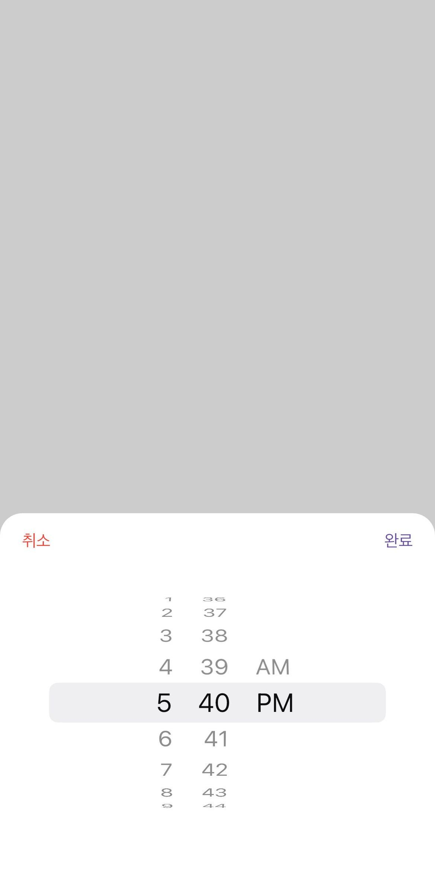
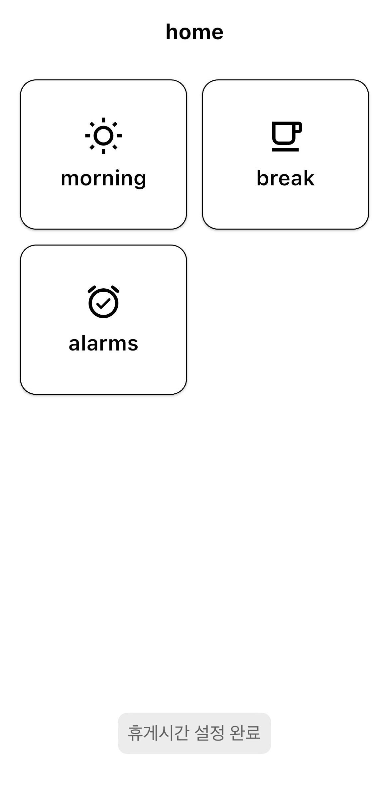
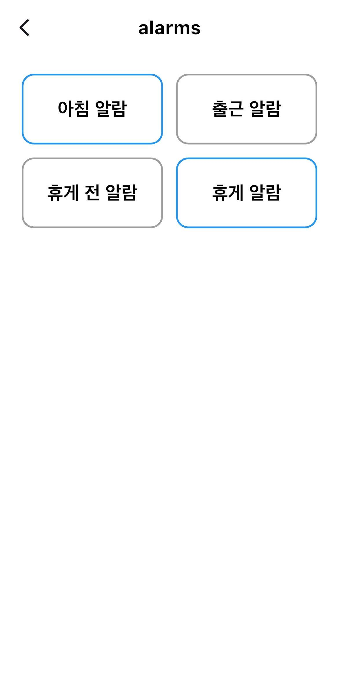

# Misojigi Notification

> A Flutter mobile app that reads your CGV work schedule from the device calendar and automatically sets commute and break time alarms.

[한국어](README.ko.md)



---

## Features

- **Morning setup** — reads today's work shift from the device calendar and registers all alarms in one tap
- **Commute alarm** — fires 3 minutes before shift start
- **Break time alarm** — fires 1 hour 50 minutes after shift start, prompting you to set the exact break time
- **Break end alarm** — pick your actual break start time; alarm fires 27 minutes later (3 min before break ends)
- **Alarm status** — view which of the 4 alarms are currently active

## Screenshots

### Permission Request

On first launch, the app requests notification and calendar access — both are required for alarms to work.

<table>
  <tr>
    <td align="center"><br/>Notification permission</td>
    <td align="center"><br/>Calendar permission</td>
  </tr>
</table>

### Home


Three cards to quickly access Morning setup, Break time, and Alarm status.

### Morning Setup

Tap Morning to read today's calendar shift and register commute + break alarms automatically.

<table>
  <tr>
    <td align="center"><br/>Schedule registered</td>
    <td align="center"><br/>Alarm status after morning setup</td>
  </tr>
</table>

### Break Time

Pick your actual break start time — an alarm fires 27 minutes later (3 min before break ends).

<table>
  <tr>
    <td align="center"><br/>Time picker</td>
    <td align="center"><br/>Break time set</td>
    <td align="center"><br/>Alarm status after break setup</td>
  </tr>
</table>

## Tech Stack

| Layer | Technology |
|---|---|
| Framework | Flutter |
| Language | Dart |
| Notifications | [flutter_local_notifications](https://pub.dev/packages/flutter_local_notifications) |
| Calendar access | [device_calendar](https://pub.dev/packages/device_calendar) |
| Timezone | [timezone](https://pub.dev/packages/timezone) / [flutter_timezone](https://pub.dev/packages/flutter_timezone) |
| Toast | [fluttertoast](https://pub.dev/packages/fluttertoast) |
| Permissions | [permission_handler](https://pub.dev/packages/permission_handler) |

## Getting Started

### Prerequisites

- Flutter SDK
- Android or iOS device / emulator

### Installation

```bash
flutter pub get
```

### Run

```bash
flutter run
```

### Build

```bash
# Android
flutter build apk

# iOS
flutter build ios
```

## Permissions Required

- **Notifications** — to schedule and fire local alarms
- **Calendar (Full Access)** — to read today's work shift